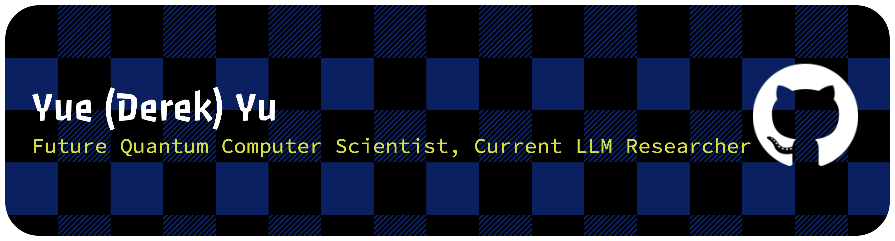

 

### Main skills

### Studying

### Connect with me!

    

<!--
     Oh, hello there, recruiters!
-->

### Employer?
> [!IMPORTANT]  
> <a href="https://drive.google.com/file/d/1uz0AtQeuj80-dCCBqGmpgQQMMdmzWgo4/view?usp=sharing" download>Download my resume</a>

