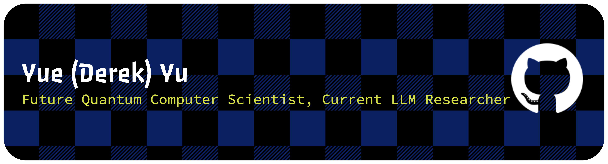

Software developer engineer intern at Amazon Web Services, previous machine learning engineering intern at Photonium (YC X25), LLM researcher with Dr. Nick Koudas, and an open source contributor to Nvidia's CUDA Quantum with my pull requests merged into Nvidia's upcoming 0.14.0 release!

### Main skills

### Studying

### Connect with me!

    

<!--
     Oh, hello there, recruiters!
-->

### Employer?
> [!IMPORTANT]  
> <a href="https://drive.google.com/file/d/1fofpLfTgky5gidV42UGenqZ5JwmmH7vj/view?usp=sharing" download>Download my resume</a>

